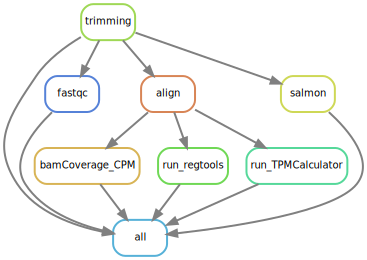
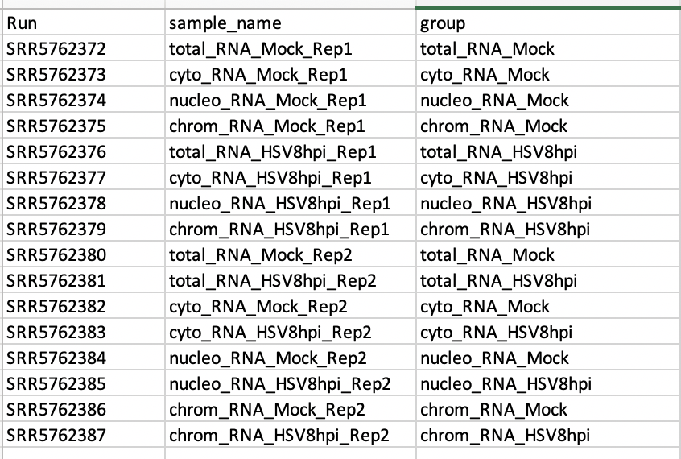

---- UNDER CONSTRUCTION ----

# Introduction
This pipeline is for bulk RNAseq analysis using snakemake workflow.  This work is forked from [khayer/rna_seq_standard_pipeline](https://github.com/khayer/rna_seq_standard_pipeline).  This fork is meant to be a detailed, step-by-step, protocol for traditonally trained life scientists with beginner level to intermidiate level bioinformatics training.  I suggest investing in a copy of "Bioinformatics Data Skills" by Vince Buffalo and reading (or refer to) chapters 1-7.  My README files are written in .Rmd using RStudio (I use this file format and style becuase its how I was introduced to bioinformatics and I like the collapsable outline structure).  This page will use publically available data (Geo dataset [GSE131473](https://www.ncbi.nlm.nih.gov/geo/query/acc.cgi?acc=gse131473)).

# Pipeline Overview
This pipeline takes fastq files and feeds them into the following pipeline/ rulegraph.

- 'trimming': removes known adaptor sequences reads
- 'fastqc': quality control examining base calls
- 'align': aligns fastq files to reference genome using the [STAR aligner](https://github.com/alexdobin/STAR)
	- 'bamCoverage_CPM':
	- 'run_regtools': takes aligned files and takes out junctions (STAR can perform its version of this step with the aligner 
	- 'run_TPMCalculator': generates TPM from BAM files
- 'salmon': "transcript level" analysis (as apposed to STAR aligner's genome level transcript analysis).  Note: short reads data analysis can skew 'salmon' results.  Long reads prefered for this pipeline

# Folder Structure
For this snakemake pipeline, raw data and project data can be stored with the following directory structure:
ATT Lab Root Directory/
```{folder structure}
├── mnt/ipsilon/thomas-tikhonenko_lab/data/public_data/
|	├── current_project_title/
|		├── SRR_Acc_List.txt
|		├── **labfastqFilesRaw**
├── home/username/
|	├── data/
|		├── current_project_title/
|			├── SRR_Acc_List.txt
|			├── **labfastqFilesRaw**
|	├── projects/
|		├── current_project_title/
|			├── reads/ -> fastqFilesLink
|			├── config/
|				├──SraRunTable.csv
|				├── config.yaml
├── scr1/users/username
|	├── temp_data/
|		├── current_project_title/
|			├── **publicFastqFilesRaw**
```
Create a new project in the project directory
```{creating new project template}
$ mkdir -p gse131473/{reads,config}; ls -Rl
```
# Conda Environment
This pipeline requires conda environments
```{installing conda environment and other dependencies}
# navigate to home directory
bash Miniconda3-latest-MacOSX-x86_64.sh # installing conda
conda update conda # update conda if already installed
conda install -n base -c conda-forge mamba #install mamba (alternative package manager to conda)
mamba create -c conda-forge -c bioconda -n snakemake snakemake # this step also creates a "snakemake" environment
conda install -c bioconda snakemake-wrapper-utils # install add-on required for pipeline 
conda activate snakemake # activate conda environment
```
# Cluster Processing Configuration (First Run Only)
CHOP using 'slurm' for cluster processing.  Once our snakemake is created, you need "attach" slurm to the environment.
```{Creating config file for cluster use in snakemake environment}
# return to home directory, find .congif directory, search for a snakemake folder
$ cd; cd .config; ls

# if no .config/snakemake folder exists, create the following directory path, create then edit a config.yaml in that location
$ mkdir -p .config/snakemake/slurm/config 
$ touch .config/snakemake/slurm/config.yaml 
$ sublime .config/snakemake/slurm/config.yaml
```
Add the following to the config file
```{.config/snakemake/config.yaml file content}
jobs: 500
cluster: "sbatch -t {resources.time} --mem={resources.mem}G -c {resources.cpu} -o logs_slurm/{rule}_{wildcards}.o -e logs_slurm/{rule}_{wildcards}.e" 
default-resources: [ mem=2000, time=60, cpu=1]
```
Save then close and verify content in the terminal:
```{ verify config.yaml file content}
$ head .config/snakemake/config.yaml
```
Common 'slurm' commands to check on submitted jobs
```{Common slurm commands}
$ squeue --me -t R # List my running jobs
$ squeue --me # List all my jobs
$ sacct -j <jobid> -l --units=G # Qacct equivalent with memory output as GB
$ sacct -j <jobid> -o maxrss # Show max memory used by job
```
# Staging Files for Pipeline: Metadata, FASTQ and Config Files
FASTQ and associated metadata files are required to run the pipeline.  Publicly available RNAseq data can be found on [NCBI's Gene Expression Omnibus](https://www.ncbi.nlm.nih.gov/geo/). From a study's Accession Display page, select "SRA Run Selector" under the "Supplementary File" section.
## Metadata Files: SraRunTable and SRR_Acc_List
Under the "Select" section, download both the Metadata (SraRunTable.txt) and the Accession List (SRR_Acc_List.txt).
### Create Sample Spreadsheet (from SraRunTable.txt)
Create a "sample spreadsheet" from the SraRunTable.txt file:
- Open in Excel the select "File > Open" and find the SraRunTable.txt file
- Follow the Import Wizard directions (Delimited > Comma > Finish)

The final document must have:


- **"Run" column**: the unique read ID.  Typically downloaded as SRR.
  - This version of the pipeline requires forward and reverse reads to be separate fastq files.   (GSM#_1 and GSM#_2).  Rename files if necessary and update these changes in the SRR_Acc_List.
- **"sample_name" column**: a description of the samples group, treatment, replicate.
- **"group" column**: the group information only (specifying test vs control)
- be saved as '.csv' file in the project's config folder

Note: "Run", "sample_name" and "group" columns must be included in the table, however they do not need to be in this specific order.  Additional columns can also be added.
### Create Sample List (from SRR_Acc_List.txt)
The SRR list will be used to automate downloading FASTQ files.  Move the SRR_Acc_List.txt to the project's run directory
### FASTQ Files
"Raw data" fastq files should be stored separately from the "working copy" used in the project folder.  
#### FASTQ Raw Data
Download **raw data** to either:
- **ATT shared directory**: for experimental data generated by the lab
- **User directory**: for experimental data generated by the lab
- **'/scr/users/username'**: for publicly available datasets
Note: these drives may have storage limits, contact on-staff bioinformaticians for specifics.

Publicly available fastq files can be downloaded automatically:
**Cluster download**:
```{cluster fastq download with SRA Tools}
# return to home directory and create a SRA tools environment
$ cd; conda create -n sra_tools_env; conda env list # semicolon allows code to be run subsequently.  Each section delimited by semicolons can be run on its own line as well
$ conda activate sra_tools_env; conda install -c bioconda sra-tools # activate SRA environment and install using conda

# Move the Accession List (SRR_Acc_List.txt) to directory to store the fastq files
$ cd; cd /scr1/users/drummerc; ls # navigates to home, then to project's read folder and verifies content

# Create temp folders if required
$ mkdir -p temp_data/gse131473

# Generate SRA tools commands to download fastq files for each sample listed in the SRR Acc List, save lines of code in a shell script, then runs script
$ cat SRR_Acc_List.txt | xargs -i{} echo "sbatch -J fastq_{} --wrap=\"fastq-dump --gzip --split-3 {}\"" > download.sh
$ bash download.sh # shell script submits download jobs to cluster using "slurm"
```
**Local download**
```{local fastq download with SRA Tools}
# return to home directory and create a SRA tools environment
cd; conda create -n sra_tools; conda env list
conda activate sra_tools_env; conda install -c bioconda sra-tools 

# download a single SRR from 
fasterq-dump --split-files SRR11180057

# download a list of SRR accession numbers
cat SRR_Acc_List.txt | xargs -i{} echo "fastq-dump --split-files {};" > download.sh; bash download.sh
```
If files need to be renamed, refer to the "rename" tab of the GSE131473_summary.xlsx.
#### FASTQ Working Copy
Make a "working copy" by creating soft links to the raw fastq files in the project's 'read' directory.
```{soft link for fastq working copy}
# Navigate reads folder, create soft links to original fastq files
$ cd; cd projects/gse131473/reads; ls
$ ln -s /scr1/users/drummerc/temp_data/gse131473/*fastq.gz .; ls # creates soft link of files ending with "fastq.qz" from the scr1/... temp folder to the current location " .". 
```

### Snakemake 'config.yaml' Configuration File 
A snakemake 'config.yaml' file needs to be located in the project config folder. Note: this is a separate config.yaml file from before.

Create a config file:
```{Creating config.yaml file}
# navigate to config folder
$ cd; cd projects/gse131473/config

# create a blank config file then open in sublime text to edit
$ touch config.yaml; sublime config.yaml # "sublime" is an alias (variable or an "alias" containing specific code)
```
This configuration file contains information about the specific reference material for this projects snakemake run.
#### Cluster Config
```{config.yaml file content}
samples: config/SraRunTable.csv
star_index: /att_lab/data/index/GRCh38.p13_kat/GENCODE_GRCh38.p13
salmon_index: /att_lab/data/index/gencode.v30.transcripts_salmon
blacklist: /att_lab/data/index/hg38-blacklist.v2.bed
gtf: /att_lab/data/index/GRCh38.p13_kat/gencode.v32.primary_assembly.annotation.gtf
gff3: /att_lab/data/index/GRCh38.p13_kat/gencode.v32.primary_assembly.annotation.gff3
tmp_dir: /scr1/users/drummerc/tmp
single_end: False
stranded: False
```
The config file should hold the following fields (this example is for hg38, but can be replaced for any other version/ species):
- samples: the SRA Table metadata file downloaded from SRA Run Selector
- star_index:
- salmon_index:
- blacklist:
- gtf:
- gff3:
- tmp_dir: (will have to create before first run)
- single_end: are the fastq files R1 and R2 or just a single R1 (should be able to tell from SRA Run Selector)
- stranded: whether the reads are forward (+) and reverse (-) strand information

Note: most of these files are in the shared ATT lab drive.  Access files via the soft link in your user home directory created earlier.
#### Local Config
```{local config}
samples: config/SraRunTable.csv
star_index: /Volumes/Bioinfo/index/GRCh38.p13_kat/GENCODE_GRCh38.p13
salmon_index: /Volumes/Bioinfo/index/gencode.v30.transcripts_salmon
blacklist: /Volumes/Bioinfo/index/hg38-blacklist.v2.bed
gtf: /Volumes/Bioinfo/index/GRCh38.p13_kat/gencode.v32.primary_assembly.annotation.gtf
gff3: /Volumes/Bioinfo/index/GRCh38.p13_kat/gencode.v32.primary_assembly.annotation.gff3
tmp_dir: /scr1/users/drummerc/tmp
single_end: False
stranded: False
```
